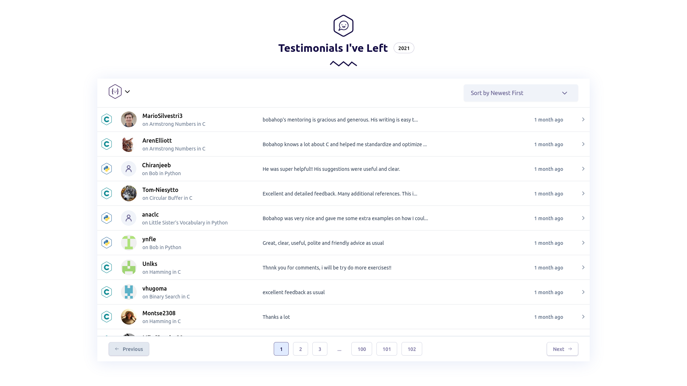

# My Submission to Exercism's Frontend Developer Challenge

This is my implementation of [Exercism's Frontend Developer Challenge for applicants](https://github.com/exercism/hiring-frontend-developer). I decided to take on the challenge using React and Tailwind 3 while forgoing TypeScript for the mean time as not to overwhelm myself. I'll revisit TypeScript through projects like those found at [Frontend Mentor](https://frontendmentor.io/) and by joining the [TypeScript track](https://exercism.org/tracks/typescript) at [Exercism.org](https://exercism.org/).

## Table of contents

- [Overview](#overview)
  - [The challenge](#the-challenge)
  - [Screenshot](#screenshot)
  - [Links](#links)
- [My process](#my-process)
  - [Built with](#built-with)
  - [What I learned](#what-i-learned)
  - [Continued development](#continued-development)
  - [Useful resources](#useful-resources)
- [Getting Started](#getting-started)
- [Author](#author)

## Overview

### The challenge
You can read the [details of the challenge here](https://github.com/exercism/hiring-frontend-developer).

### Screenshot



### Links

- Live Site URL: [https://antonyotero.github.io/exercism-challenge](https://antonyotero.github.io/exercism-challenge)

## My process

### Built with

- [React](https://reactjs.org/) - JS library
- [Tailwind CSS](https://tailwindcss.com/) - CSS framework
- [Headless UI](https://headlessui.dev/) - UI components
- [Heroicons](https://heroicons.com/) - SVG icons
- [GitHub Pages](https://pages.github.com/) - Hosting
- [Yarn](https://yarnpkg.com/) - Package manager

<!-- ### What I learned

...revisit
 -->
### Continued development

What I enjoyed the most about this project was that it forced me to use tools that I hadn't before. It helped me become more comfortable reading through documentation, looking  at examples, and asking the right questions. I enjoyed using Tailwindcss and very quickly learned enough to extend the utility class to suite the needs of the project. Paired with Heroicons and Headless UI, Tailwindcss allowed me to very quickly put together the styling of the site and focus on the functionality. I will definitely continue to use Tailwindcss and has peaked my curiosity towards libraries like Bulma. As for React, while I managed to put together a solution, I know there is still a lot to learn. After seeing the potential of React I want to explore Next.js and TypeScript. The most difficult part of the challenge to me was creating the tests. I have a lot to learn about Jest, React Testing Library, and Test-Driven Development in general.

### Useful resources

- [npm vs Yarn Cheat Sheet](https://www.digitalocean.com/community/tutorials/nodejs-npm-yarn-cheatsheet) - This is a cheat sheet that you can use as a handy reference for npm & Yarn commands.
- [Create React App | Getting Started](https://create-react-app.dev/docs/getting-started) - If you need help setting up the project.
- [Tailwind CSS | Create React App](https://tailwindcss.com/docs/guides/create-react-app) - Setting up Tailwind CSS in a Create React App project.
- [Create React App | Deployment](https://create-react-app.dev/docs/deployment#github-pages) - This section of the Create-react-app documentaion explains how to deploy your app onto GitHub Pages.

## Getting Started

To get a local copy up and running follow these simple example steps.

### Prerequisites

- [Yarn](https://yarnpkg.com/getting-started/install)
- [GitHub CLI](https://cli.github.com/)

### Setup

With GitHub CLI installed, to fork this repo and clone it locally in your computer, run:

``` zsh
gh repo fork AntonyOtero/exercism-challenge --clone=true
```

### Install

To install all the project dependencies, within the directory of the cloned project, run:

``` zsh
yarn
```

### Usage

To start the repo on a local server, run:

``` zsh
yarn start
```

Then you can navigate to the localhost url it provides (e.g. http://localhost:3000/).

### Run tests

To run the included tests:

``` zsh
yarn test
```

### Deployment

To deploy your forked repo onto GitHub Pages:

1. Make sure you head to the `Pages` section of your repos `Settings` and enable github pages on your repo (if it's not already). Also, be sure to set the source branch to `gh-pages`.

2. Open your `package.json` and update the `homepage` field for your project:

*Be sure to update your username in the url below*

```zsh
"homepage": "https://myusername.github.io/exercism-challenge"
```

3. Run the following command to deploy your site:

``` zsh
yarn deploy
```

## Author

- Website - [antonyotero.com](https://www.antonyotero.com/)
- LinkedIn - [@antonyotero](https://www.linkedin.com/in/antonyotero/)
